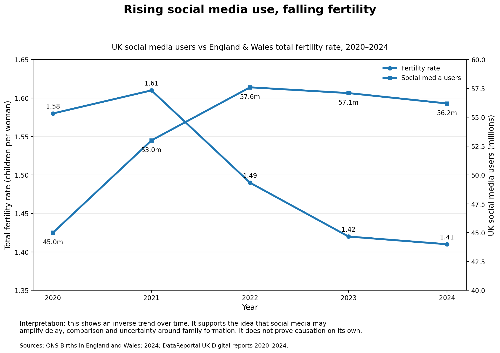

# Fertility Rate in England & Wales vs UK Social Media Consumption

This project visualises the relationship between **UK social media adoption** and the **total fertility rate in England & Wales** from 2020 to 2024.

The chart shows an inverse trend: social media use rose sharply and then remained high, while the fertility rate in England & Wales declined to historically low levels.



## Core argument

This project does **not** claim that social media directly causes falling birth rates.

A stronger and more defensible argument is:

> Social media magnifies the structural reasons people delay or avoid having children. It does not create the fertility crisis on its own, but it makes the existing pressures feel more visible, more urgent and more emotionally overwhelming.

Fertility decline is shaped by many factors, including housing affordability, childcare costs, income insecurity, unstable relationships, delayed marriage, career pressure, weak family support and wider cultural change.

Where government policy fails to make parenthood feel affordable, stable and supported, social media amplifies that failure by constantly exposing people to comparison, fear, uncertainty and idealised lifestyles.

## Why social media matters

Social media can influence fertility decisions indirectly through five mechanisms:

### 1. Comparison

People are constantly exposed to curated versions of other people’s lives: better homes, better careers, better relationships, better holidays and better bodies.

This can make parenthood feel like something that should only happen once life is perfectly arranged.

### 2. Delay culture

Modern social media often rewards optimisation: improve your career, improve your finances, improve your relationship, improve yourself.

The hidden message becomes:

> You are not ready yet.

This can reinforce delayed adulthood and delayed family formation.

### 3. Fear amplification

Online discussions about parenting often highlight the hardest parts: high costs, exhaustion, loss of freedom, relationship pressure, childcare struggles and mental load.

These concerns are real, but social media can make them feel constant and unavoidable.

### 4. Weakening confidence in the future

Having children requires some belief that the future is manageable.

When people repeatedly see content about housing crises, economic instability, climate anxiety, poor public services and political failure, parenthood can feel like a risky decision rather than a hopeful one.

### 5. Visibility of policy failure

If housing, childcare, parental leave and family support are weak, social media makes those failures visible at scale.

People do not just experience pressure privately anymore. They see thousands of others expressing the same fear, frustration and hesitation.

That turns individual anxiety into a shared social narrative.

## The role of government failure

A falling birth rate should not be framed only as a personal lifestyle choice.

It also reflects whether society makes family formation feel possible.

When governments fail to address housing affordability, childcare costs, insecure work and weak parental support, people respond rationally by delaying or avoiding parenthood.

Social media then magnifies those pressures by making the cost of parenthood more visible and the risks more emotionally salient.

In simple terms:

> Government failure creates the pressure. Social media spreads and intensifies the feeling of that pressure.

## Data used

| Year | England & Wales total fertility rate | UK social media users |
|---:|---:|---:|
| 2020 | 1.58 | 45.0m |
| 2021 | 1.61 | 53.0m |
| 2022 | 1.49 | 57.6m |
| 2023 | 1.42 | 57.1m |
| 2024 | 1.41 | 56.2m |

## Sources

### Fertility rate

Source: Office for National Statistics  
Dataset/report: Births in England and Wales: 2024 refreshed populations  
URL: https://www.ons.gov.uk/peoplepopulationandcommunity/birthsdeathsandmarriages/livebirths/bulletins/birthsummarytablesenglandandwales/2024refreshedpopulations

### Social media users

Source: DataReportal UK Digital reports

- 2020: https://datareportal.com/reports/digital-2020-united-kingdom
- 2021: https://datareportal.com/reports/digital-2021-united-kingdom
- 2022: https://datareportal.com/reports/digital-2022-united-kingdom
- 2023: https://datareportal.com/reports/digital-2023-united-kingdom
- 2024: https://datareportal.com/reports/digital-2024-united-kingdom

## Files in this repository

```text
Fertility-rate_England_and_Wales/
├── birthrate_social_media_data.csv
├── plot_birthrate_social_media.py
├── graph/
│   └── birthrate_social_media_chart.png
├── .github/
│   └── workflows/
│       └── main.yml
└── README.md
