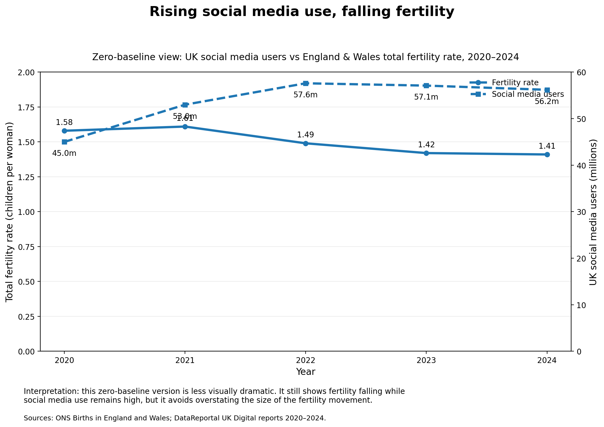

# Fertility Rate in England & Wales vs UK Social Media Consumption

This project explores the relationship between **UK social media adoption** and the **total fertility rate in England & Wales** from 2020 to 2024.

The chart uses a **zero-baseline view** to avoid visually exaggerating the fertility decline.



## Core idea

This project does **not** claim that social media directly causes falling birth rates.

A stronger interpretation is:

> Social media acts as a mirror and amplifier of the wider social and economic pressures that make parenthood feel harder, later or less realistic.

Fertility decline is shaped by many factors, including housing affordability, childcare costs, income insecurity, delayed partnership formation, unstable work, gender expectations, family policy and wider cultural change.

Social media matters because it makes these pressures more visible, more comparable and more emotionally intense.

## Why social media is useful as a mirror

Social media usage can help us understand falling birth rates because it reflects the emotional climate around adulthood.

People do not make decisions about children in isolation. They make them inside a social environment shaped by stories, fears, comparisons and expectations.

Social media exposes those signals at scale.

It shows what people are anxious about:

- whether they can afford a home
- whether childcare is manageable
- whether relationships feel stable enough
- whether work feels secure enough
- whether parenthood means losing freedom
- whether the future feels safe enough to bring children into

The platform does not create all these problems, but it can magnify them.

## The role of government and structural failure

A falling birth rate should not be reduced to individual lifestyle choice.

It also reflects whether society makes family formation feel possible.

Where government policy fails to address housing costs, childcare costs, insecure work and weak parental support, people respond rationally by delaying or avoiding parenthood.

Social media then magnifies those failures by making the cost and anxiety of parenthood visible at scale.

In simple terms:

> Structural pressure makes parenthood harder. Social media makes that pressure more visible, more shareable and more emotionally contagious.

## Chart

The generated chart compares:

1. **England & Wales total fertility rate**
2. **UK social media users in millions**

The chart is saved at:

```text
plots/fertility_social_media_zero_scale.png
